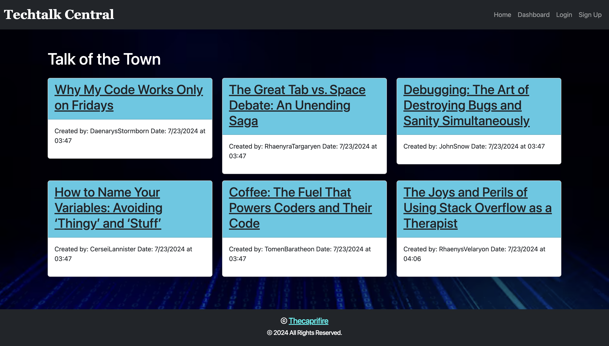
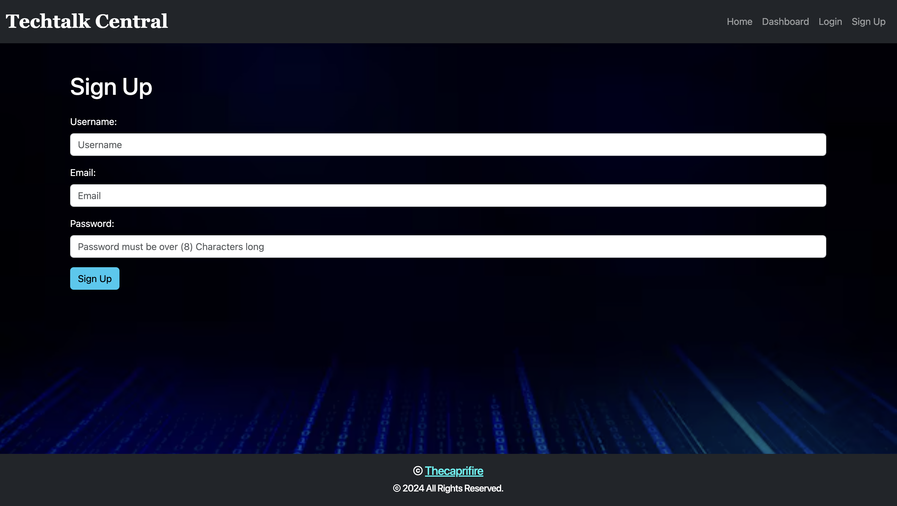
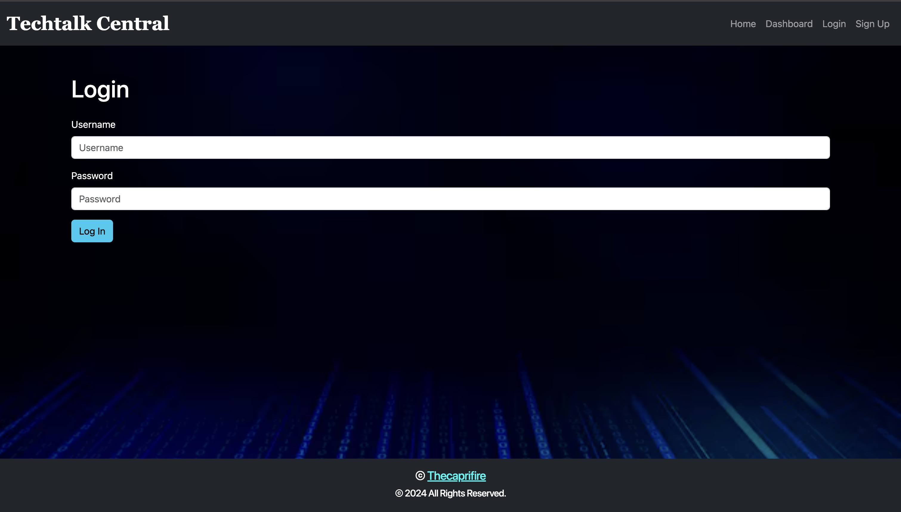
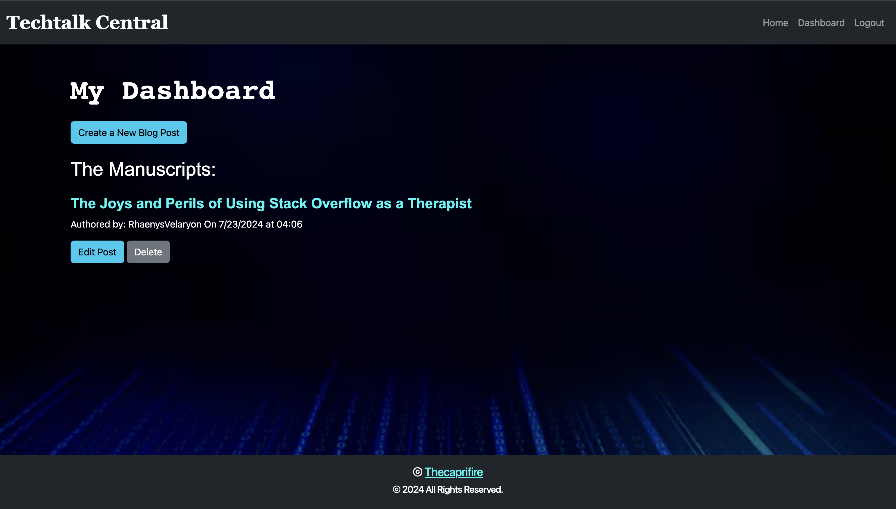

# Techtalk Central

[](https://github.com/Thecaprifire)
[](https://choosealicense.com/licenses/mit/)
  
  
## Description:
This repository contains a Tech Blog CMS-style site built from scratch, designed to provide developers with a platform to publish and manage their blog posts and interact with others’ posts. The application follows the Model-View-Controller (MVC) architecture and employs Handlebars.js for templating, Sequelize for Object-Relational Mapping (ORM), and the express-session npm package for authentication.


 ## Table of Contents
  * [Description](#description)
  * [The Challenge](#the-challenge)
  * [User Story](#user-story)
  * [Acceptance Criteria](#acceptance-criteria)
  * [Installation Process](#installation-process)
  * [Walkthrough Video](#walkthrough-video)
  * [Screenshots](#screenshots)
  * [Resources](#resources)
  * [Questions](#questions)
  * [License](#license)


## The Challenge:
Develop a CMS-style blog site similar to a Wordpress site, where developers can publish their blog posts and comment on other developers’ posts as well.


## User Story
```md
AS A developer who writes about tech
I WANT a CMS-style blog site
SO THAT I can publish articles, blog posts, and my thoughts and opinions
```


## Acceptance Criteria
```md
GIVEN a CMS-style blog site
WHEN I visit the site for the first time
THEN I am presented with the homepage, which includes existing blog posts if any have been posted; navigation links for the homepage and the dashboard; and the option to log in
WHEN I click on the homepage option
THEN I am taken to the homepage
WHEN I click on any other links in the navigation
THEN I am prompted to either sign up or sign in
WHEN I choose to sign up
THEN I am prompted to create a username and password
WHEN I click on the sign-up button
THEN my user credentials are saved and I am logged into the site
WHEN I revisit the site at a later time and choose to sign in
THEN I am prompted to enter my username and password
WHEN I am signed in to the site
THEN I see navigation links for the homepage, the dashboard, and the option to log out
WHEN I click on the homepage option in the navigation
THEN I am taken to the homepage and presented with existing blog posts that include the post title and the date created
WHEN I click on an existing blog post
THEN I am presented with the post title, contents, post creator’s username, and date created for that post and have the option to leave a comment
WHEN I enter a comment and click on the submit button while signed in
THEN the comment is saved and the post is updated to display the comment, the comment creator’s username, and the date created
WHEN I click on the dashboard option in the navigation
THEN I am taken to the dashboard and presented with any blog posts I have already created and the option to add a new blog post
WHEN I click on the button to add a new blog post
THEN I am prompted to enter both a title and contents for my blog post
WHEN I click on the button to create a new blog post
THEN the title and contents of my post are saved and I am taken back to an updated dashboard with my new blog post
WHEN I click on one of my existing posts in the dashboard
THEN I am able to delete or update my post and taken back to an updated dashboard
WHEN I click on the logout option in the navigation
THEN I am signed out of the site
WHEN I am idle on the site for more than a set time
THEN I am able to view posts and comments but I am prompted to log in again before I can add, update, or delete posts
```


## Installation Process
1.	Configure Environment Variables:
	-	Enter your login credentials and other environment-specific settings in the `.env' file.
2.	Open Integrated Terminal:
	-	Launch an integrated terminal from your editor.
3.	Install Dependencies:
	-	Install the essential packages to initialize the application by running 'npm install'. The key packages used include:
	     - bcrypt: [Version 5.1.1](https://www.npmjs.com/package/bcrypt)
         - bcryptjs: [Version 2.4.3](https://www.npmjs.com/package/bcryptjs)
         - connect-session-sequelize: [Version 7.1.7](https://www.npmjs.com/package/connect-session-sequelize)
         - pg: [Version 8.12.0](https://www.npmjs.com/package/pg)
         - dotenv: [Version 16.4.5](https://www.npmjs.com/package/dotenv)
         - express: [Version 4.19.2](https://www.npmjs.com/package/express)
         - express-handlebars: [Version 7.1.3](https://www.npmjs.com/package/express-handlebars?activeTab=versions)
         - express-session: [Version 1.18.0](https://www.npmjs.com/package/express-session)
         - handlebars: [Version 4.7.8](https://www.npmjs.com/package/handlebars)
         - sequelize:[Version 6.37.3](https://www.npmjs.com/package/sequelize)
4.	Set Up the Database:
	-	Navigate to the directory containing the database schema and create a new database using the `psql` command.
5.	Seed the Database:
	-	Populate the database with test data by executing the seed command specified in the package.json file.
6.	Start the Application:
	-	Run `npm start` to launch the Express server.
7.	Test the Application:
	-	Verify the application’s functionality by accessing it through Render.

## Walkthrough Video:
[Click Here to Watch](https://youtu.be/HB062ez_-Jk)


## Screenshots:
### Figure 1.
 
### Figure 2.
 
### Figure 3.
 
### Figure 4.
 


## Resources
- Dynamic JavaScript
- bcrypt: [Version 5.1.1](https://www.npmjs.com/package/bcrypt)
- bcryptjs: [Version 2.4.3](https://www.npmjs.com/package/bcryptjs)
- connect-session-sequelize: [Version 7.1.7](https://www.npmjs.com/package/connect-session-sequelize)
- pg: [Version 8.12.0](https://www.npmjs.com/package/pg)
- dotenv: [Version 16.4.5](https://www.npmjs.com/package/dotenv)
- express: [Version 4.19.2](https://www.npmjs.com/package/express)
- express-handlebars: [Version 7.1.3](https://www.npmjs.com/package/express-handlebars?activeTab=versions)
- express-session: [Version 1.18.0](https://www.npmjs.com/package/express-session)
- handlebars: [Version 4.7.8](https://www.npmjs.com/package/handlebars)
- sequelize:[Version 6.37.3](https://www.npmjs.com/package/sequelize)
  
## Questions
  Contact the author with any questions!<br>
  Github link: [Thecaprifire](https://github.com/Thecaprifire)<br>
  Email: ianjandaluz@gmail.com


## License
  This project is [MIT](https://choosealicense.com/licenses/mit/) licensed.<br />

  Copyright © 2024 [JAN IAN DALUZ](https://github.com/Thecaprifire)
  
  <hr>
  <p align='center'><i>
  Here’s to your coding journey! 🎉 JAN IAN DALUZ
  </i></p>